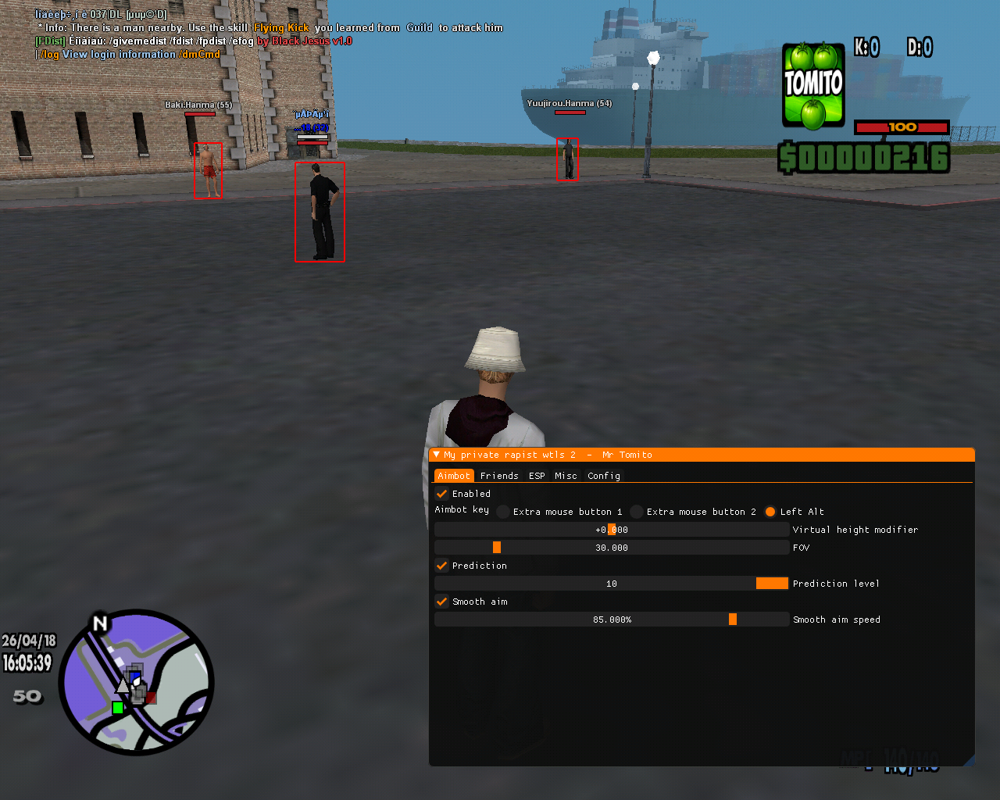

# SA:MP hack

Inject after logging in to the game!!

Menu - '_Insert_'

::1:: Right-click on the SAMP_Internal project and select Properties.
::2:: 2. Go to .VC++ Directories
::3:: 3. In the Include Directories box, click the arrow and select Edit, then add this path:
                      $(DXSDK_DIR)Include
::4:: 4. In the Library Directories box, click Edit and add this path:
                       $(DXSDK_DIR)Lib\x86
::5:: 5. Click Apply and then OK

                _CRT_SECURE_NO_WARNINGS
